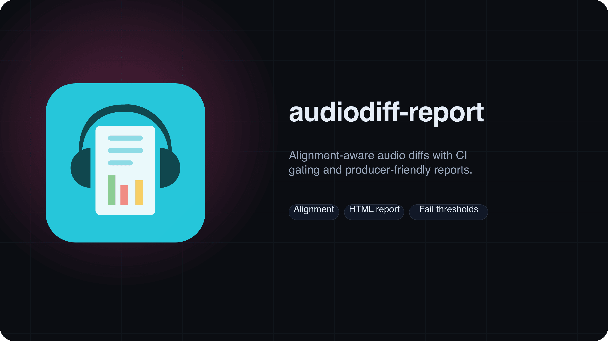
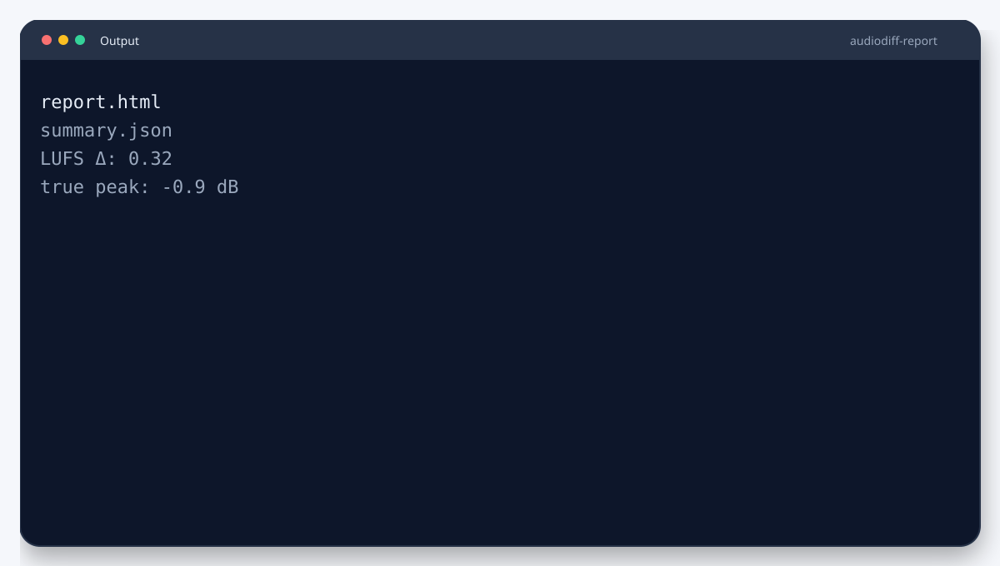
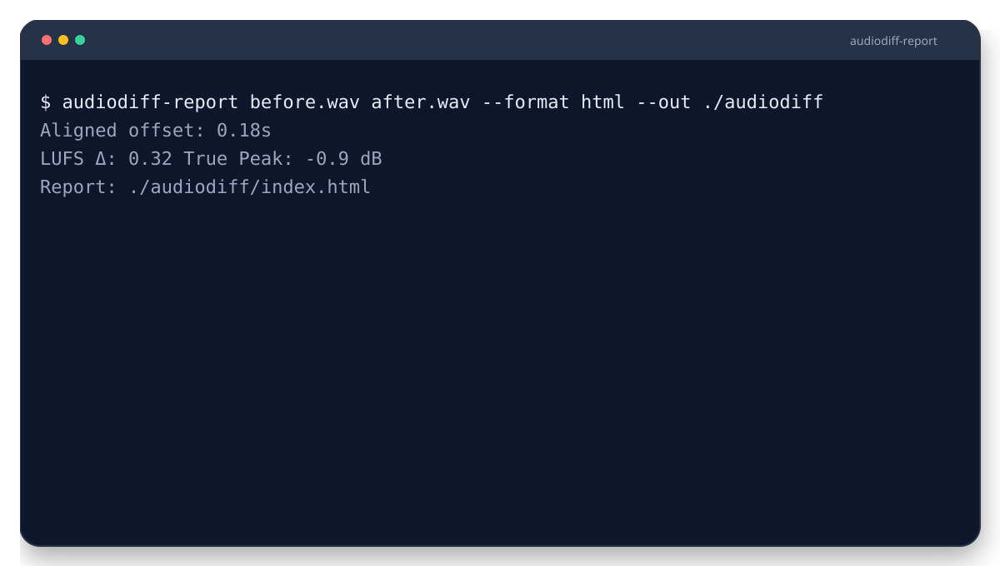

<picture>
  <source srcset="branding/hero.svg" type="image/svg+xml">
  
</picture>

# AudioDiff Report
Alignment-aware audio diffs with CI gating and producer-friendly reports. Align renders, compute metrics, and emit deterministic outputs. Produces an HTML report you can attach to PRs.

**Type:** CLI + Library (Node.js)

   

> [!IMPORTANT]
> For MP3 support, enable `--ffmpeg` in environments where FFmpeg is available.

## Highlights
- Aligns audio before computing diffs.
- LUFS/peak metrics with configurable thresholds.
- HTML reports for producers and CI.


## Output


Example artifacts live in `examples/`.

Need help? Start with `docs/troubleshooting.md`.

Metrics are approximations for CI gating. See `docs/metric-fidelity.md`.

Sample report: `examples/report.html`.


## Quickstart
```bash
npx audiodiff-report before.wav after.wav --format html --out ./audiodiff
```


## CI in 60s
```yaml
- name: Run audio diff
  run: npx audiodiff-report before.wav after.wav --format html --out ./audiodiff
- name: Upload report
  uses: actions/upload-artifact@v4
  with:
    name: audiodiff-report
    path: ./audiodiff
```

## Demo


```bash
audiodiff-report before.wav after.wav --format html --out ./audiodiff
```


## Compatibility
- Node.js: 20 (CI on ubuntu-latest).
- OS: Linux in CI; macOS/Windows unverified.
- External deps: FFmpeg optional for MP3 (`--ffmpeg`).

## Guarantees & Non-Goals
**Guarantees**
- Deterministic alignment and metrics for identical inputs.
- HTML/JSON/Markdown reports are always generated.

**Non-Goals**
- Not a mastering-grade loudness analyzer.
- Does not replace critical listening.

## Docs
- [Requirements](docs/requirements.md)
- [Installation](docs/installation.md)
- [Examples](docs/examples.md)
- [Configuration](docs/configuration.md)
- [Report Output](docs/report-output.md)
- [Metric Fidelity](docs/metric-fidelity.md)
- [Alignment](docs/alignment.md)
- [Troubleshooting](docs/troubleshooting.md)
- [Guarantees & Non-Goals](docs/guarantees.md)
- [Constraints](docs/constraints.md)

More: [docs/README.md](docs/README.md)

## Examples
See `examples/README.md` for inputs and expected outputs.

## Used By
Open a PR to add your org.


## Contributing
See `CONTRIBUTING.md`.

## License
MIT.
